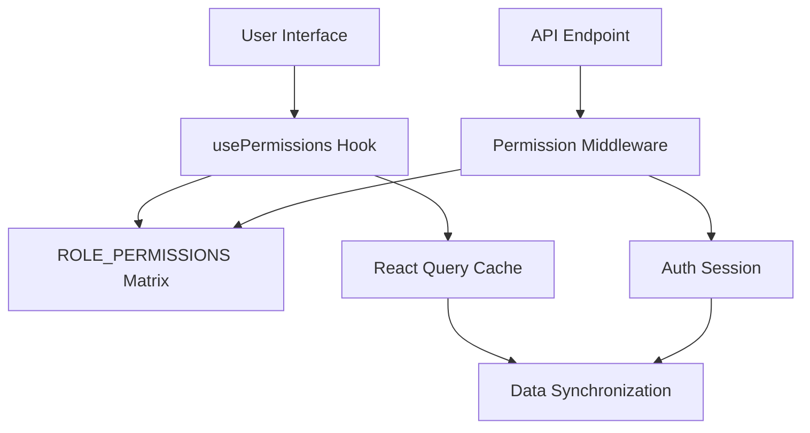
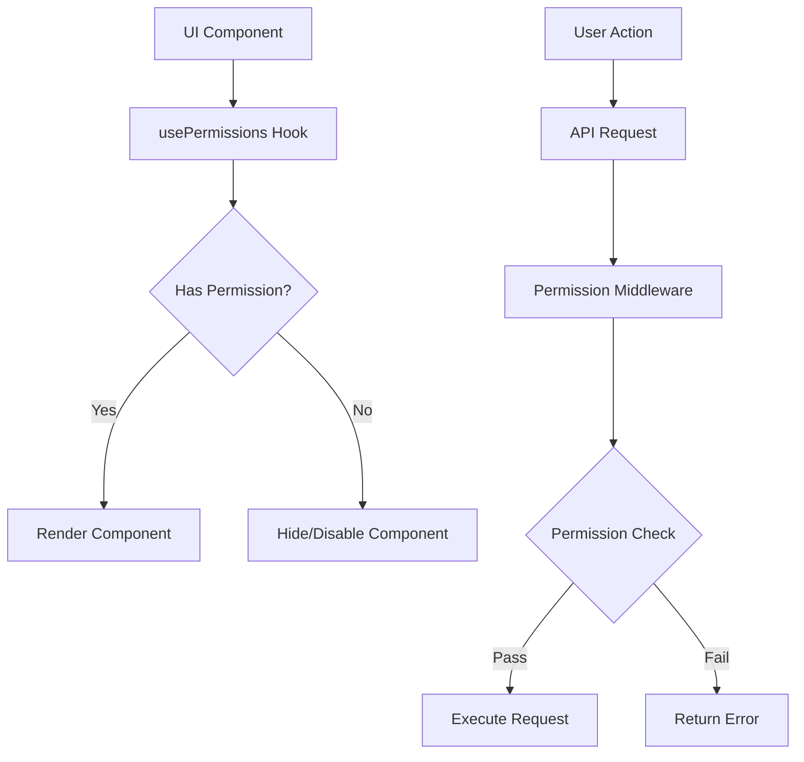

# System Patterns

## Architecture Overview

The application follows a client-server architecture with clear separation of concerns:

### Client-Side Architecture
- Single Page Application (SPA) built with React and Vite
- Component-based structure with shadcn/ui
- Client-side routing with Wouter
- State management with React Query and local state
- Form handling with React Hook Form and Zod validation

### Server-Side Architecture
- Express.js server with TypeScript
- RESTful API endpoints
- Session-based authentication with Passport.js
- PostgreSQL database with Drizzle ORM
- WebSocket support for real-time features

## Design Patterns

### Frontend Patterns

1. **Component Composition**
   - Atomic design principles
   - Reusable UI components from shadcn/ui
   - Composition over inheritance

2. **State Management**
   - React Query for server state
   - Local state with React hooks
   - Form state with React Hook Form
   - Polling-based real-time updates

3. **Routing Pattern**
   - Client-side routing with Wouter
   - Route-based code splitting
   - Protected routes with authentication

4. **Data Fetching**
   - React Query for data fetching and caching
   - Optimistic updates
   - Error boundary handling

5. **Real-time Data Patterns**
   - Polling with React Query
   - Configurable polling intervals
   - Background polling for inactive tabs
   - Optimistic updates for better UX
   - Stale-time configuration for network optimization

### Backend Patterns

1. **RESTful API Design**
   - Resource-based routing
   - Standard HTTP methods
   - Consistent error handling
   - Input validation with Zod

2. **Authentication Flow**
   - Session-based authentication
   - Passport.js strategies
   - Secure session handling
   - Role-based access control

3. **Database Access**
   - Repository pattern with Drizzle ORM
   - Type-safe queries
   - Migration management
   - Connection pooling

4. **Real-time Communication**
   - WebSocket integration
   - Event-based messaging
   - Connection management

## Component Patterns

1. **Layout Components**
   - Consistent page structure
   - Responsive design
   - Theme management

2. **Form Components**
   - Controlled inputs
   - Validation with Zod
   - Error handling
   - Loading states

3. **Data Display Components**
   - Tables with sorting and filtering
   - Charts and visualizations
   - Loading skeletons
   - Error states

4. **Interactive Components**
   - Modals and dialogs
   - Tooltips and popovers
   - Drag and drop interfaces
   - Infinite scrolling

## Error Handling

1. **Client-Side Errors**
   - React error boundaries
   - Form validation errors
   - API error handling
   - Fallback UI components

2. **Server-Side Errors**
   - Global error middleware
   - Validation errors
   - Database errors
   - Authentication errors

## Security Patterns

1. **Authentication**
   - Session management
   - Password hashing
   - CSRF protection
   - Secure cookies

2. **Authorization**
   - Role-based access control
   - Resource-level permissions
   - API route protection

3. **Data Security**
   - Input sanitization
   - SQL injection prevention
   - XSS protection
   - CORS configuration

## Performance Patterns

1. **Client-Side Performance**
   - Code splitting
   - Lazy loading
   - Asset optimization
   - Caching strategies
   - Optimized polling intervals

2. **Server-Side Performance**
   - Connection pooling
   - Query optimization
   - Response caching
   - Rate limiting

3. **Real-time Data Management**
   - Configurable polling intervals
   - Background polling optimization
   - Network usage optimization with stale-time
   - Fallback mechanisms for network issues
   - Balance between data freshness and server load

## Testing Patterns

1. **Unit Testing**
   - Component testing
   - Hook testing
   - Utility function testing
   - Mocking strategies

2. **Integration Testing**
   - API endpoint testing
   - Authentication flow testing
   - Database interaction testing

3. **End-to-End Testing**
   - User flow testing
   - Cross-browser testing
   - Performance testing

## Development Workflow

1. **Code Organization**
   - Feature-based structure
   - Shared utilities
   - Type definitions
   - Constants and configurations

2. **Build Process**
   - Development server with Vite
   - Production builds
   - Environment configuration
   - Asset management

3. **Deployment**
   - Build optimization
   - Environment variables
   - Database migrations
   - Monitoring and logging

## Maintenance Patterns

1. **Code Quality**
   - TypeScript strict mode
   - ESLint configuration
   - Prettier formatting
   - Code review guidelines

2. **Documentation**
   - Code comments
   - API documentation
   - Component documentation
   - Setup instructions

3. **Monitoring**
   - Error tracking
   - Performance monitoring
   - User analytics
   - Server health checks

## Authentication & Authorization

### Role-Permission System

#### Architecture

#### Core Components
1. **Permission Types (`types/permissions.ts`)**
   - Type-safe permission strings
   - Role type definition
   - ROLE_PERMISSIONS matrix

2. **Permission Hook (`hooks/use-permissions.ts`)**
   - Client-side permission checks
   - Role-based access control
   - Integration with auth context

3. **API Middleware (`server/middleware/permissions.ts`)**
   - Server-side permission validation
   - Session verification
   - Error handling

4. **User Management Interface**
   - Permission-based UI rendering
   - Role management controls
   - Debug information panel

#### Permission Check Flow

#### Data Synchronization
- React Query for data management
- Cache invalidation on updates
- Manual refresh capability
- Session-based validation
